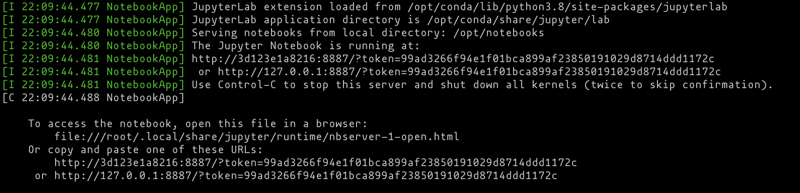
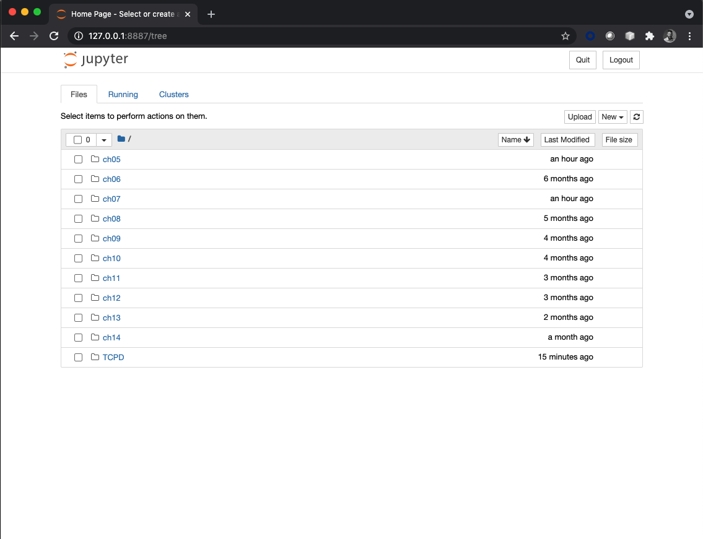
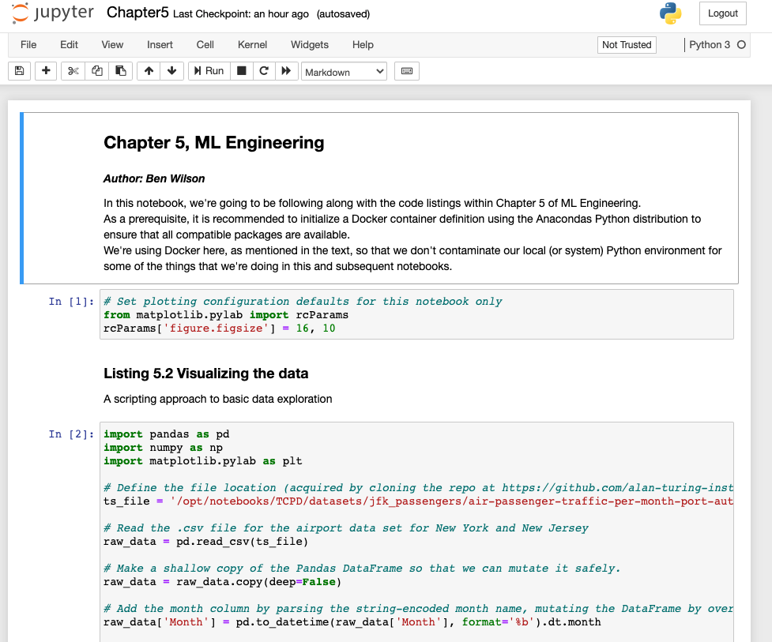

# ML-Engineering
Reference code base for ML Engineering in Action, Manning Publications
Author: Ben Wilson


### About this repo
This is a companion to the Manning book Machine Learning Engineering in Action.
Within this repo are two separate types of notebooks, linked to the examples shown in chapters within the book.
The formats of these notebooks come in several different flavors, depending on the type of examples that they are covering:
- Jupyter notebooks for 'standalone Python'
- PySpark Databricks archive notebooks (these can be imported into Databricks or Databricks Community Edition (free of charge))
- PySpark html notebook representations (these can be loaded into any web browser for visualization)
- Scala Spark Databricks notebooks (in .dbc, .html, and pure .scala formats)

For the Jupyter notebooks, a pre-configured bash script is provided at the root level of this directory that will generate a docker image and automatically start the created container for you to rapidly get started with these notebooks.


### Getting Started with Docker
To utilize the pre-built environment and follow along with the examples in the book with additional notes and code that wasn't included in the book, we first need Docker.

There are a number of different ways to acquire Docker. Please visit their [website](https://docs.docker.com/get-docker/) for instructions on installing the desktop GUI and the engine.

#### Creating the image
The file [here](/docker_setup.sh) will, when executed through a bash command in your linux terminal, create the container to execute the Jupyter notebooks in this repo.
The script will link this repo to the docker environment through piped synchronization to your local machine, download the required data to execute the code in the notebooks, and
install the necessary dependencies to get Jupyter working (as well as some required libraries that are not part of the Anacondas runtime).
```text 
NOTE: Within the bash script is a variable named 'port' that will allow you to customize 
the access port that Jupyter and Docker will use to allow you to utilize a Jupyter notebook 
from your local web browser. If you currently have Jupyter running on your machine with the 
general 'default port' of 8888, this configuration utilizes 8887. Feel free to change it 
if there is a conflict.
```
Once the shell script is executed, as shown below, the container will be constructed for your use.


#### Getting Jupyter to start up
At the end of the container creation process, your terminal will have a url that you can paste
into your web browser of choice, as shown below.



After copying one of these URL's (I typically stick to the local host 127.0.0.1/ one), paste it
into a browser. You'll have all of the notebooks available that are part of the chapters of
ML Engineering in Action. 



Navigating within each of the chapters (the ones that have supported standalone Python Jupterlab
examples; the Spark ones will not load here!) will give you the notebook links that you can click
on and open the notebook in a new tab for reading, running, modification, and anything else 
you'd like to do.

